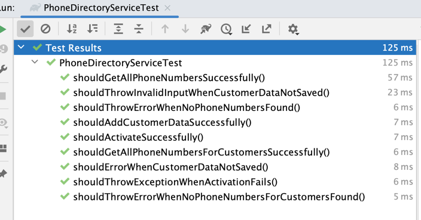

#                                                   Project: Phone Directory
#### Author : RASHMI VISHNU

##  Description
This project implements and Simple Phone directory for any Telecom operator with few basic capabilities listed below:
      
      -  get all phone numbers
      
      -  get all phone numbers of a single customer
      
      -  activate a phone number
This also provides few basic validations around the inputs , which can be extended further based on the needs.

## Pre-requsites
The project utilises the following technologies:
- Java 8
- Spring Boot
- Gradle
- H2 in memory as the data store (with few pre-loaded entries)
- IntelliJ if you would like to extend the features
 
## Build & Run
The project utilises Gradle Wrapper.
To build the project, browse to the project root directory and simply execute:
```
./gradlew build
```
To run the application, execute:
```
./gradlew bootRun
```
This will initialise SpringBoot on port 8080 where the API can be accessed via:
```
http://localhost:8888
```
  
# Execution Details
NOTE: Pre loaded with some data through sql scripts

Preloaded data is provided through the SQL scripts under resources/data.sql
3 Customers with the Id and their name are as below:

(1, 'Rahul Dravid')
(2,'Steven Smith')
(3, 'ABC Smith')

### Swagger ###
http://localhost:8888/swagger-ui/index.html


## Endpoints

POST multiple customer data with the Phone numbers
```shell
http://localhost:8888/v1/phone-directory/phone_numbers/customers

curl --location 'http://localhost:8888/v1/phone-directory/customers' \
--header 'Content-Type: application/json' \
--header 'Accept: */*' \
--data '[
  {
    "firstName": "culpa dolore",
    "lastName": "mollit sed incididunt deserunt",
    "phoneNumbers": [
      {
        "number": "0411000111"
      }
    ]
  }
]'
```

GET a customer's phone numbers
```shell
http://localhost:8888/v1/phone-directory/customer/{customer_id}

curl --location 'http://localhost:8888/v1/phone-directory/customer/{customer_id}' \
--header 'Accept: application/json'

** customer_Id: is the unique Id returned by the POST Api, or use the pre loaded data provided.
Sample Values for customer ID: 1 Or 2 or 3 (from pre loaded data)
```

GET all phone numbers with the current status
```shell
http://localhost:8888/v1/phone-directory/phone_numbers 

curl --location 'http://localhost:8888/v1/phone-directory/phone_numbers' \
--header 'Accept: application/json'
```

PATCH to Activate a phone number
```shell
http://localhost:8888/v1/phone-directory/phone_numbers/{phoneNumber}/activate

Sample Curl:
curl --location --request PATCH 'http://localhost:8888/v1/phone-activation/phone_numbers/0411000111/activate' \
--header 'Accept: */*'
```

# Technical Notes
Below are some details on technical aspects of the project and few learnings.

## Assumptions & Design considerations
1. Default port will be -8888, which can be modified
2. Only minimal validations are provided.
3. A customer can have many phone numbers
4. Phone numbers are unique and will be for a single customer
5. Comes with few pre-loaded entries, which can be extended by providing an add API
6. 2 seperate controllers to keep it extendable to provide more operations

## Scope for Enhancements
1. Extensive test cases to cover more scenarios can be added
2. Validations can be enhanced to include more on the inputs. Basic validations are provided for now.
3. User Interface can be provided.
4. Various levels of testing can be included
5. More APIs to add and update directory can be included
6. Replace H2 Db, with proper db instance
7. Containerize for better deployment


### Testing
Unit tests
TODO: Can be improved to include component,blackbox and controller tests etc.



## Access the Database (H2)

http://localhost:8888/h2-console/login.do

user: sa
password: password


#### Sample execution screen-shots:


